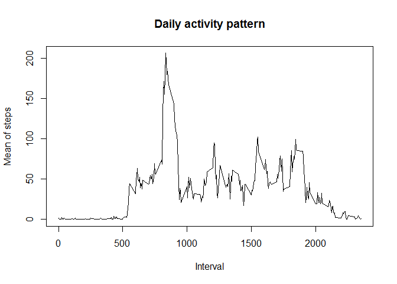
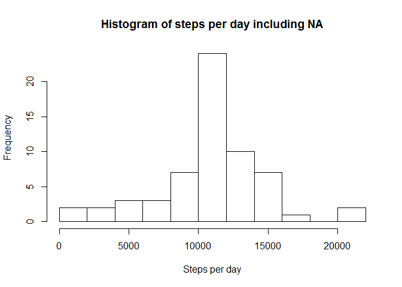
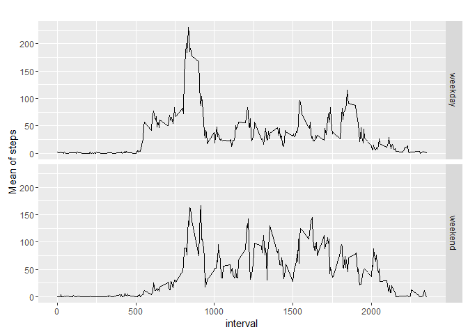

# Reproducible Research: Peer Assessment 1


## Loading and preprocessing the data


```r
unzip("activity.zip")
d<-read.csv("activity.csv")
d$date<-as.Date(d$date)
library(dplyr)
```

```
## 
## Attaching package: 'dplyr'
```

```
## The following objects are masked from 'package:stats':
## 
##     filter, lag
```

```
## The following objects are masked from 'package:base':
## 
##     intersect, setdiff, setequal, union
```

```r
d<-tbl_df(d)
```


## What is mean total number of steps taken per day?

Before plotting the histogram, I group_by using date and sum the steps

```r
total <- d %>% group_by(date) %>% summarize(steps_day=sum(steps, na.rm = T))
hist(total$steps_day, breaks = 10, xlab = "Steps per day", main="Histogram of steps per day")
```

<!-- -->

```r
mean(total$steps_day, na.rm=T)
```

```
## [1] 9354.23
```

```r
median(total$steps_day, na.rm = T)
```

```
## [1] 10395
```

## What is the average daily activity pattern?

Now I group by interval and average per day to plot the time series, and using the same data frame, it's easy to calculate which is the maximun 5 minutes interval

```r
time<-d %>% group_by(interval) %>% summarize(mean_interval=mean(steps, na.rm=T))

plot(time$interval, time$mean_interval, type="l", xlab="Interval", ylab="Mean of steps", main="Daily activity pattern")
```

<!-- -->

```r
time[which.max(time$mean_interval), ]
```

```
## Source: local data frame [1 x 2]
## 
##   interval mean_interval
##      (int)         (dbl)
## 1      835      206.1698
```


## Imputing missing values

First, calculate the number as the sum of NA

To complete values, I decided to use the mean for that interval, so I defined an auxiliary function to return that value, getMeanForInterval, and call it for every NA in dComplete (new dataframe)

Mean and median increases after filling the values and become EQUAL


```r
sum(is.na(d$steps))
```

```
## [1] 2304
```

```r
dComplete<-d

getMeanForInterval<-Vectorize(function(int) time$mean_interval[time$interval==int])
dComplete$steps[is.na(d$steps)]<-getMeanForInterval(d$interval[is.na(d$steps)])

totalComp <- dComplete %>% group_by(date) %>% summarize(steps_day=sum(steps))
hist(totalComp$steps_day, breaks = 10, xlab = "Steps per day", main="Histogram of steps per day including NA")
```

<!-- -->

```r
mean(totalComp$steps_day)
```

```
## [1] 10766.19
```

```r
median(totalComp$steps_day)
```

```
## [1] 10766.19
```


## Are there differences in activity patterns between weekdays and weekends?

Apparently on weekdays people get up early ;)

```r
dComplete$weekday<-factor(ifelse(weekdays(dComplete$date, abbreviate = T) %in% c("sá.", "do.", "sa.", "su"), "weekend", "weekday"))

timeWeek<-dComplete %>% group_by(weekday, interval) %>% summarize(mean_interval=mean(steps, na.rm=T))

library(ggplot2)

qplot(interval, mean_interval, data=timeWeek, geom=c("line"), facets = weekday ~ ., ylab = "Mean of steps", main="")
```

<!-- -->

